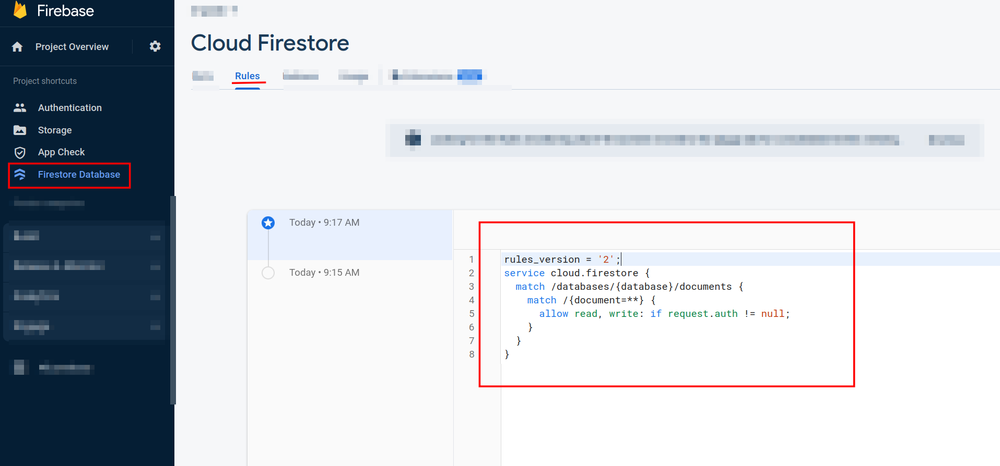

# Firebase Realtime Database App Setup Guide

This guide will walk you through the process of setting up a Firebase Realtime Database app with Google authentication and storage separated by users.

Make sure to follow each step carefully to ensure a successful setup.

---

## Step 1: Create a Firebase Project

1. Go to the [Firebase Console](https://console.firebase.google.com/) and create a new project.
2. Follow the prompts to set up your project and enable Firebase services for your app.
3. Free plan is enough for this project.


## Step 2: Set Up Authentication

1. In the Firebase Console, navigate to the **Authentication** section.
2. Enable the **Google** sign-in method.


3. Follow the prompts to configure the Google sign-in method.
4. Add `localhost` to the **Authorized domains** list if it hasn't appeared.


## Step 3: Set Up App Check

1. In the Firebase Console, navigate to the **App Check** section.
2. Enable **App Check**.
3. Enable reCAPTCHA v3, maybe Enterprise edition since it still has a free version.


4. For reCAPTCHA v3 you need keys. Go to the [reCAPTCHA admin console](https://www.google.com/recaptcha/admin/create) and create a new reCAPTCHA v3.
5. You should use reCAPTCHA secret key for App Check.
6. Site key (as there is siad "for HTML code") is used in `.env` file under `GOOGLE_RECAPTCHA_KEY` key.

Moreover, you just may add firebase debug token to `.env` file under `FIREBASE_DEBUG_TOKEN` key for development mode.

These can be generated on the Firebase Console > AppCheck > Apps > Manage Debug Tokens.


## Step 4: Set Up Storage

1. In the Firebase Console, navigate to the **Storage** section.
2. Follow the prompts to set up your storage bucket.
3. Rules example:

```
rules_version = '2';

// Grants a user access to a node matching their user ID
service firebase.storage {
  match /b/{bucket}/o {
    // Files look like: "user/<UID>/path/to/file.txt"
    match /user/{userId}/{allPaths=**} {
      allow read, write: if request.auth != null && request.auth.uid == userId;
    }
  }
}
```

Here the app will store audio files of the user speaking.


## Step 5: Set Up Cloud Database

1. In the Firebase Console, navigate to the **Database** section.
2. Create a **Cloud Firestore** database.
3. You will be redirected to the Cloud Firestore console. There you should enable native mode.
4. Then, go to firebase app and click on Cloud Firestore.
5. Rules example:

```
rules_version = '2';
service cloud.firestore {
  match /databases/{database}/documents {
    match /{document=**} {
      allow read, write: if request.auth != null;
    }
  }
}
```



6. Next you should create collections: settings, dialogs, messages. You can do it in the Firebase Console > Cloud Firestore > Data. Also, during collection creation you must set some dummy document what you can delete right after collection was created.


8. And add indices:


Dialogs collection: **userUid**: _ASC_ and **uid**: _ASC_.

Messages collection: **dialogUid**: _ASC_ and **createdAt**: _ASC_.

You should wait until indices will be created.

## Firebase Service Account

1. In the Firebase Console, navigate to the **Settings** section.
2. Go to the **Service Accounts** tab.
3. Click **Generate new private key**.


> Your private key gives access to your project's Firebase services. Keep it confidential and never store it in a public repository.

4. Download the private key and save it in the `server` folder as `service-account.json`.

---

Congratulations! You have successfully set up a Firebase Realtime Database app with Google authentication and storage separated by users.
