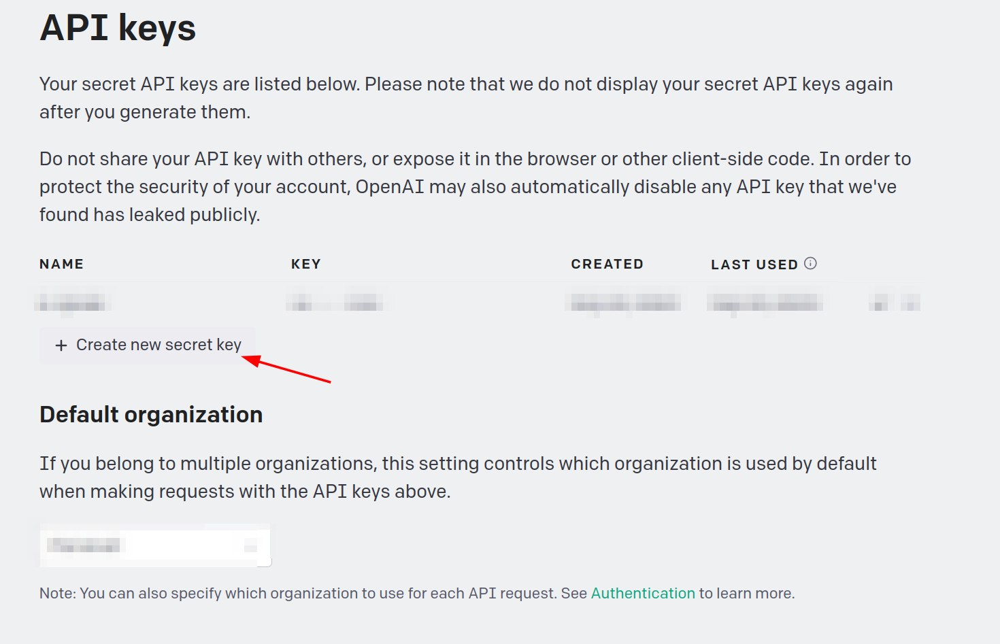
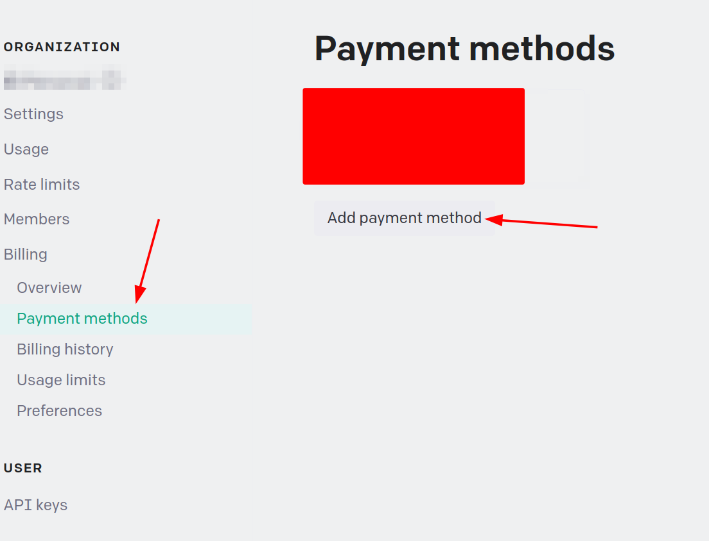

# Generate instruction how to set up OpenAI API key and pay in billing

Instructions:

1. Go to the [OpenAI website](https://platform.openai.com/overview) and sign up for an account.
2. Once you have an account, go to the [API keys section](https://platform.openai.com/account/api-keys) and generate a new API key.

3. Copy the API key and save it in a secure location.
4. Go to the [billing section](https://platform.openai.com/account/billing/overview) and add a [payment method](https://platform.openai.com/account/billing/payment-methods).

5. You must pay for the API usage. You can start from 10$ and then increase the amount if you need it. Usage statistic you can find in the [usage section](https://platform.openai.com/account/usage).
6. You can now start using the OpenAI API with your API key.

Note: Make sure to keep your API key secure and do not share it with anyone.
